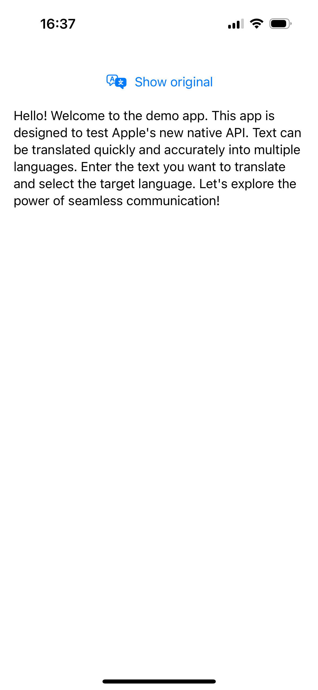

# iOS translation API demo 

This is a demo app showcasing the capabilities of Apple’s new Translation framework, introduced to facilitate seamless text translation directly on iOS devices. The app demonstrates how developers can utilize this framework to translate text efficiently into multiple languages, leveraging on-device processing for speed and privacy.

To learn more about the Translation framework, visit <a target="_blank" href="https://developer.apple.com/documentation/translation/">Apple’s Documentation.</a>

## Screenshots

  
  

